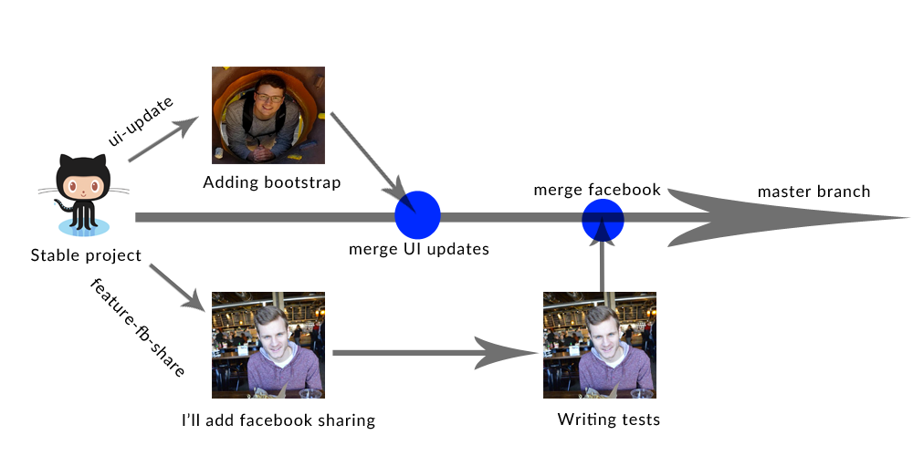

# Git tutorial
##### By the [uWindsor CSS](http://css.uwindsor.ca)

## WTF is Git?
Git is the most widely used **version control system** in the world.

## WTF is version control?

Version control is a system which records changes to a set of files over
time.  It creates a collection of snapshots of your files at different states,
and allows you to restore specific versions.  Version control is very commonly
used to manage software development, but really it could be used for any kind
of files.

## Why should I use version control?

Imagine you are working on a school project due the next day.  You manage to
hack something together, but its really messy.  Since you have some time,
you decide to do your T.A. a favour and refactor a bit.  Your codes ends up
even messier than the original and now its totally broken and doesn't even compile.
To add on to that, you closed your editor and went and made a sandwich at some
point, so holding down ctrl-z and praying to Donald Knuth isn't an option.
You probably should have used version control, or more specifically git. Had
you read this tutorial before you started your assignment, your work flow would
have looked something like this:

If you were using git you could have "committed" (taken a snapshot of)
your working code.  This way no matter how bad you botch things during
the refactor you can always revert back to it and get those partial marks
on your assignment.

## Using Git For Collaboration

So Git is great at saving you from breaking your code, but it also works really
well as a collaboration tool.  Instead of having to share code with your teammates
via email like a caveman, you could use a shared repository.  Sites like Github
(look at your address bar) provide a repository sharing service.  Multiple
users can push code to a single repository and collaborate together without having
to manually copy and paste all the files that anyone changes.
There are a few features that git provides, such as branching, that make
this less of a headache than it may seem.

## How do I git?

### 1. Install git
#### Windows Users

* [Follow these instructions](https://help.github.com/articles/set-up-git/#platform-windows)

Alternatively, dual boot linux OR SSH into the school server and follow the linux instructions.

#### OSX Users

* If you haven't already, [install Homebrew](http://brew.sh/)
* Open a terminal and run `brew install git`

#### Linux Users
* If you are using a school terminal, or if you are SSH'd into your school
account then you already have git installed
* If you are using your own linux machine then you can install git via
your package manager
* Assuming that you are running ubuntu, run `sudo apt-get install git`
at a terminal

### 2. Make a Github account
* Go to [Github.com](http://github.com) and sign up
* *Optional:* apply for a [student developer pack](https://education.github.com/pack)
to get free/discounted access to a ton of different services

### 3. Create your first repository
* Go to your profile and create your very first repository
* Open a terminal and follow the instructions provided by github

## Basic Commands

### git add [filename / folder]
Adds a file/folder to be included in the next commit.

Example usages:

`git add assignment1.c` - adds the file assignment1.c to the next commit

`git add assignment1/` - adds all files in the assignment1 folder to the next commit

`git add .` - add everything in the current directory (recursively) to the next commit

### git commit -m [message]
Create a commit (snapshot) of your code in its current state.  This state can then
be recalled.  The message is a short description explaining how your code changed
from its previous state.

Example usage:

`git commit -m "added unicode support"`

### git push [remote] [branch]
Push your code to a remote repository, such as github.

Example usage:

`git push origin master` - If you followed the instructions github provided,
your remote will be named origin

### git log
View a log of previous commits

Example usage:

`git log`

Example Output:

    commit d8bd2e8dad890fa84da47fa11bb6fb930c4c9544
    Author: Quinn Perfetto <thequinnftw@gmail.com>
    Date:   Sun May 29 13:54:16 2016 -0700

        spelling

    commit d663ec8807c3f74cbad90c50506d84b7680d1684
    Author: Quinn Perfetto <thequinnftw@gmail.com>
    Date:   Sun May 29 13:48:42 2016 -0700

        added basic usage

    commit dbe9bcf19ca2564342c64a047b2879c321e9657b
    Author: Quinn Perfetto <thequinnftw@gmail.com>
    Date:   Sat May 28 18:44:00 2016 -0700

        added installation instructions

    commit 18b4e5b6004b7b1b13f83815bec7e59cb05a9bec
    Author: Quinn Perfetto <thequinnftw@gmail.com>
    Date:   Sat May 28 18:17:17 2016 -0700

        added collaboration section

    commit 227f9cc263de04590d10184dfa80ad79cc776543
    Author: Quinn Perfetto <thequinnftw@gmail.com>
    Date:   Sat May 28 17:00:10 2016 -0700

        First commit, style check

### git checkout [-b [branch name]] [branch/commit]
Move your state to a previous commit (ignore the -b and branch name for now,
that will be covered in the next section).

Example Usage

`git checkout db0e9b` - rollback to the "added installation instructions" commit
above, only a small prefix of the commit ID is needed

### Full example

* Make a change to assignment1.c
* `git add assignment1.c` - add it to the next commit
* `git commit -m "finished assignment, output is correct"` - make the commit
* `git push origin master` - push the code to github

## Branching
Up until now you have probably envisioned your commit history as linear,
but git provides **branching** functionality.  This makes it easier to
collaborate as everyone working can create their own *branch* and then someone
can *merge* the differing code together.

