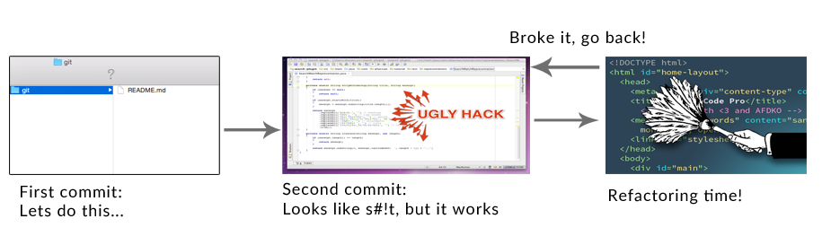

# Git tutorial
##### By the [uWindsor CSS](http://css.uwindsor.ca)

## WTF is Git?
Git is the most widely used modern **version control system** in the world.

## WTF is version control

Version control is a system which records changes to a set of files over
time.  It creates a collection of snapshots of your files at different states,
and allows you to restore specific versions.  Version control is very commonly
used to manage software development, but really it could be used for any kind
of files.

## Why should I use version control?

Imagine you are working on a school project due the next day.  You manage to
hack something together, but its really messy.  Since you have some time,
you decide to do your T.A. a favour and refactor a bit.  Your codes ends up
even messier than the original and now its totally broken and doesn't even compile.
To add on to that, you closed your editor and went and made a sandwhich at some
point, so holding down ctrl-z and praying to Donald Knuth isn't an option.
You probably should have used version control, or more specifically git. Had
you read this tutorial before you started your assigment, your workflow would
have looked something like this:

